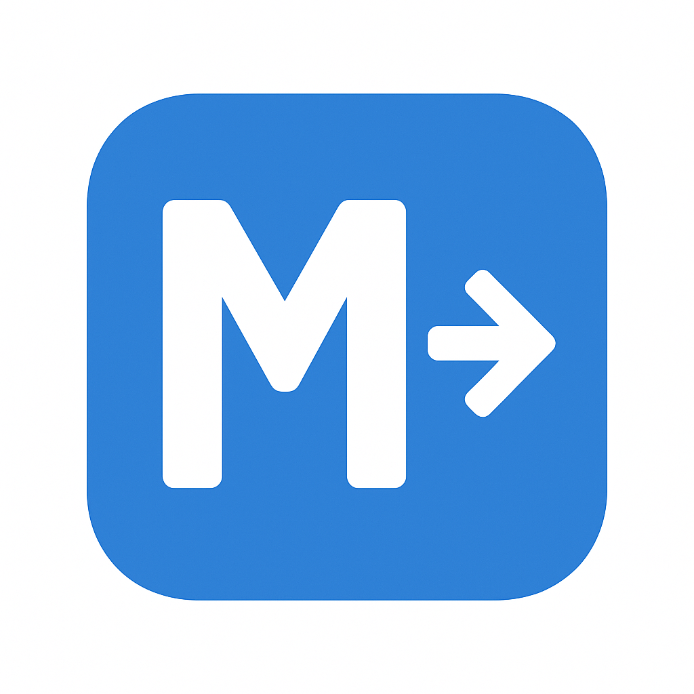

# EdiMarkWeb

EdiMarkWeb es un potente editor Markdown basado en la web, diseñado para estudiantes, desarrolladores y creadores de contenido. Proporciona una experiencia fluida para escribir en Markdown con una vista previa de HTML en tiempo real, soporte completo de LaTeX para fórmulas matemáticas complejas y una intuitiva interfaz de múltiples documentos mediante pestañas.

## Características

*   **Vista previa en tiempo real**: Vea al instante el HTML renderizado de su texto Markdown.
*   **Soporte de LaTeX**: Escriba y renderice fórmulas matemáticas complejas utilizando KaTeX.
*   **Interfaz de múltiples documentos**: Trabaje en varios archivos a la vez con un práctico sistema de pestañas.
*   **Barra de herramientas de formato enriquecido**: Aplique fácilmente formatos como encabezados, negrita, cursiva, listas, enlaces y más.
*   **Resaltado de sintaxis**: Los bloques de código se resaltan para una mejor legibilidad.
*   **Modo claro/oscuro**: Cambie entre temas claros y oscuros para su comodidad.
*   **Diseño personalizable**: Ajuste los paneles del editor y de vista previa a su gusto.
*   **Arrastrar y soltar archivos**: Abra rápidamente archivos `.md` arrastrándolos y soltándolos en el editor.
*   **Internacionalización**: Disponible en varios idiomas.
*   **Búsqueda y reemplazo**: Busque y reemplace texto en sus documentos.
*   **Atajos de teclado**: Un completo conjunto de atajos de teclado para una edición eficiente.

## Cómo usar

Simplemente abra `index.html` en su navegador web para comenzar a usar EdiMarkWeb. Para obtener una guía detallada sobre todas las características y atajos de teclado, consulte el [Manual de usuario](manual.md).

## Tecnologías

*   **HTML5, CSS3, JavaScript**
*   **Marked.js**: Para la conversión de Markdown a HTML.
*   **Turndown**: Para la conversión de HTML a Markdown.
*   **KaTeX**: Para el renderizado de fórmulas LaTeX.
*   **CodeMirror**: Para los editores de Markdown y HTML.
*   **Lucide Icons**: Para los iconos de la interfaz de usuario.
*   **Tailwind CSS**: Para el estilo de la interfaz de usuario.

## Licencia

Este proyecto está bajo la Licencia MIT; consulte el archivo [LICENSE](LICENSE) para más detalles.